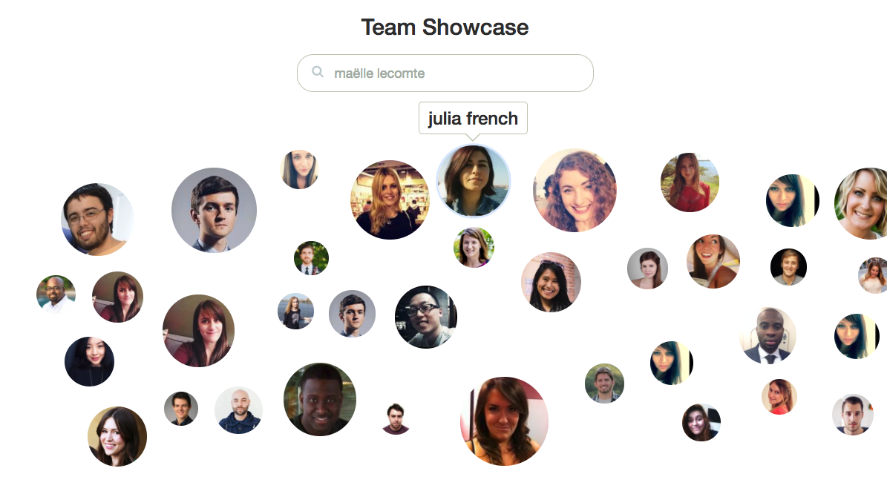

## Team Showcase ##



### TL;DR

jQuery powered team showcase based on floating bubbles of employee headshots. Contains built in search functionality. Built for previous employer. Presented here are some cool GIFs of it in action along with some of the high level code.

### Background

The Team Showcase is a project I originally built as a Software Developer with FreshBooks in 2016. At the time we were looking to completely redo our company team page which was simply a long list of employee headshots with short bios. Looking for inspiration externally, our design team landed on Stripe's team page which featured headshot bubbles floating from right to left across the screen. We decided that we would imitate the design, but rewrite all of the front-end code.

The result, after several weeks of hard work is what you see above in the image and below in the animated gifs - a floating bubbles showcase of employee headshots with built in search functionality.

This repo uses *randomly generated headshots* as opposed to employee faces (using [https://randomuser.me/](https://randomuser.me/)) - you can consult the the original team page at [www.freshbooks.com/about/team](https://www.freshbooks.com/about/team) (still there as of May 2018... scroll down past the execs to load the showcase).

### How it Works

The team showcase uses a javascript algorithm to randomly scatter images present on the DOM onto a scrollable canvas. The crux of the code is the shape placing loop:

```
// main loop which goes over everybody in the company
// and finds a spot for their face on the canvas
for (i = 1; i <= numpeople; i++) {

	$person = $(".person#" + i);

	// get the coordinates for the shape on the canvas
	coords = setShapeLocation();

	// draw the shape (translate from original position at 0,0)
	$person.find("img").css("width", coords.d);
	$person.translate2d({ x: coords.x1 + coords.d/2, y: coords.y1 });

	// push names of all people onto array for use by search functionality
	namesArray.push($person.find(".person-name").text());
}
```

Below you'll find the code for `setShapeLocation()`. Essentially, this attempts to pick a random location on the canvas on which to place the person. If that location is already occupied, it tries another random locaton. Notice that in the event that the canvas can no longer accomodate additional images because of lack of space, the shape location is set even if it overlaps with another person. This should never happen in practice, if the canvas size parameters are set adequately, but is nonetheless a good defensive programming technique.

```
// finds an appropriate location for the shape and returns its coordinates
function setShapeLocation() {
	// generate a random location for the rectangle
	coords = randomLocation();

	// loop through an array of previous rectangle positions
	for (j = 0; j < drawnShapeArray.length; j++) {

		// this code prevents the javascript from running into an infinite loop
		// if a shape takes longer than 3 seconds to be placed, break out of all future loops;
		// shapes will be overlapping, but this is better than having the whole page freeze
		now = new Date().getTime();
		if( (now - startT) > 3000) {
			if (DEBUG) console.log("failed to find empty space on canvas");
			break;
		}

		while (
			(coords.x1 - SPACE < drawnShapeArray[j].x2) &&
			(coords.x2 + SPACE > drawnShapeArray[j].x1) &&
			(coords.y1 - SPACE < drawnShapeArray[j].y2) &&
			(coords.y2 + SPACE > drawnShapeArray[j].y1)
		) {
			coords = randomLocation();

			// we're attempting a new location, reset drawnShapeArray index
			j = 0;
		}
	}

	// the coordinates of the newly found shape
	// are now pushed onto the array of all shapes
	drawnShapeArray.push(coords);

	return coords;
}
```

#### Loading

The showcase lazily loads when the user scrolls to the `.canvas` element. This helps prevent the page load speeds from suffering and stuttering due to the computational intensity of the place-finding algorithm.

It also animates each person with a fade-in when they first appear on the canvas.


#### Searching

The user can search for any team member by using the search field. Autocomplete suggestions are listed. Selecting a person scrolls the canvas to that user and highlights their image while fading all the rest.


